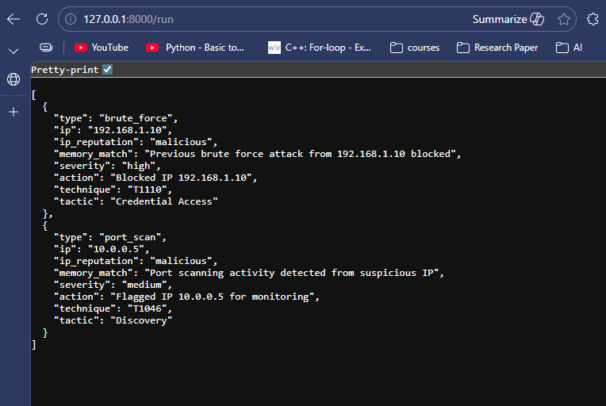
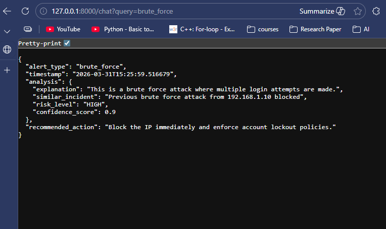
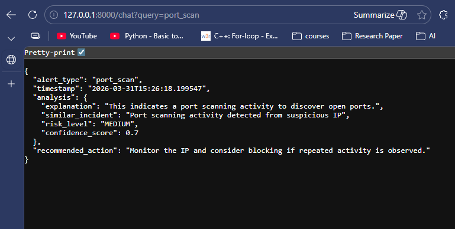

# 🛡️ Agentic SOC Analyst (AI-Powered Security System)


## 🚀 Overview

This project simulates an **AI-driven Security Operations Center (SOC) analyst** capable of detecting, analyzing, and responding to cyber threats autonomously.

It integrates **multi-agent architecture, MITRE ATT&CK mapping, vector memory (FAISS), and AI-powered explanations** to replicate real-world SOC workflows.

---

## 🔥 Key Highlights

* 🔍 Detects cyber threats (Brute Force, Port Scanning)
* 🤖 Multi-agent SOC workflow simulation
* 🗺️ Maps attacks to MITRE ATT&CK framework
* 🧠 Uses FAISS for memory-based incident correlation
* 💬 AI-powered chat system for alert explanation
* ⚡ Automated response actions based on severity
* 📊 Structured JSON output (production-style API)

---

## 🏗️ Architecture

```
Logs → Detection → Investigation → Decision → Response → MITRE Mapping → Memory (FAISS) → Chat Interface
```

---

## 🛠️ Tech Stack

* **Backend:** FastAPI (Python)
* **AI / Memory:** LangChain + FAISS
* **Embeddings:** HuggingFace Transformers
* **Data:** JSON-based simulated logs

---
## 🏅 Certifications & Badges

[](https://www.credly.com/badges/e7ff3bc0-9ea0-47a1-928e-6a8c52ca52ab/public_url)
[](https://www.credly.com/badges/d6cf8ad7-0b1a-45ed-b03f-07552cca3bea/public_url)

- 🛡️ Cisco Cybersecurity Certification (Credly Verified)  
- 🔐 ISC2 Certified in Cybersecurity (CC)

## ▶️ How to Run

```bash
git clone https://github.com/Ayushsh1/agentic-soc-ai.git
cd agentic-soc-ai

python -m venv venv
venv\Scripts\activate

pip install -r requirements.txt
uvicorn main:app --reload
```

---

## 🌐 API Endpoints

### 🔹 Run Detection

```
http://127.0.0.1:8000/run
```

### 🔹 Chat Analysis

```
http://127.0.0.1:8000/chat?query=brute_force
```

---

## 📸 Demo

### 🔹 Detection Output


### 🔹 Chat Analysis


---

## 📊 Example Output

```json
{
  "alert_type": "brute_force",
  "timestamp": "2026-03-31T15:20:57",
  "analysis": {
    "explanation": "This is a brute force attack...",
    "similar_incident": "Previous brute force attack...",
    "risk_level": "HIGH",
    "confidence_score": 0.9
  },
  "recommended_action": "Block the IP immediately"
}
```

---

## 💡 Future Enhancements

* Real-time log ingestion (ELK Stack)
* Web dashboard (React)
* Integration with threat intelligence APIs
* Role-based SOC dashboard
* ML-based anomaly detection

---

## 🎯 What Makes This Project Unique?

Unlike basic security projects, this system:

* Simulates a **real SOC analyst workflow**
* Uses **memory-based reasoning (FAISS)**
* Provides **explainable AI outputs**
* Implements **agent-based decision making**

---

## 👨‍💻 Author

**Ayush Shende**
